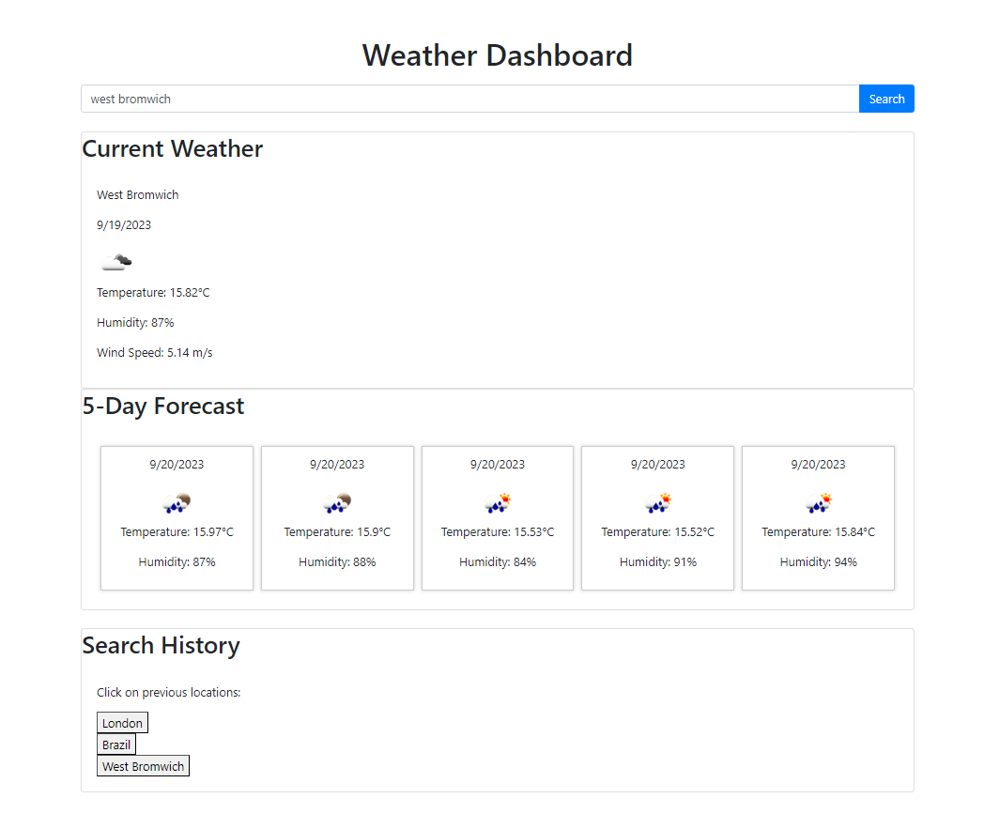

# weather-dashboard

Create a weather dashboard with form inputs.

## Whats been done?

- we used the https://openweathermap.org/api API to retrieve data to display
- we display both the current weather data and a 5-day forecast for a specified city.
- we retrieve information such as city name, date, temperature, humidity, wind speed, and the weather icon.
- The current weather data is displayed in a large card on the web page.
- The 5-day forecast data is displayed in smaller cards, each containing date, weather icon, temperature, and humidity for the upcoming five days.
- we have a search history functionality, allowing users to see their previous search locations as clickable buttons!
- When a user clicks on a city in the search history, it fetches and displays both current and future weather conditions for that city!
- we are using error handling for cases where data cannot be fetched.

## Images

- above is an example of how the weather dashboard looks.

## Link for deployment
